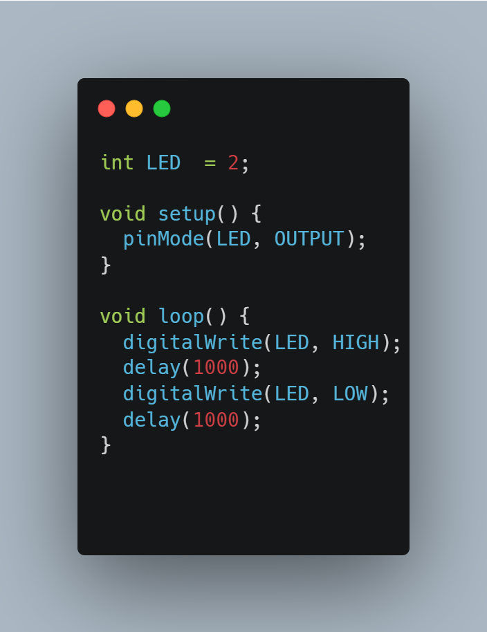

# Project to control LED with the internet using ESP32 and Arduino

The objective of this project is to learn how to move from an ESP32 to a cloud database and then from the internet back to the ESP32.

ESP32 is preferred here since it is small, powerful, fast and can connect to WiFi. It works with 3.3V.

---
## Equipment
- ESP32
- Breadboard
- Connecting wires
- Resistors
- USB Cable

---
## Steps
### Part 1
**The objective of Part 1 is to successfully upload a code using Arduino to the ESP32**
- Connect the ESP32 with a USB connector to the laptop and install drivers for the FTDI chip(CP2102)
- Open Arduino IDE to make the ESP32 work with Arduino and open preferences and in the extra URLs paste this link (https://raw.githubusercontent.com/espressif/arduino-esp32/gh-pages/package_esp32_index.json)
- Go to tools and search for ESP32 in the boards manager and install the boards. After installation, select one board. In our project we used the ESP32 Dev Module which has an LED on pin 2.
- We tested the LED using the code 
- Select COM of the ESP32 and click the upload button while pressing the boot button on the board.
- Release the button once the "connecting" message appears and the LED blinks once the code is uploaded successfully.
---
### Part 2
**The objective of part 2 is to create a database and a website to control the ON and OFF status of the LED**
- Create a website using a hosting provider(We used netlify)
- Create a new database on the website giving it a name, username and password
- In the empty database create a table with two sections: ID and Status 
- To create a control website download the index.php and esp32_update.php from the following link (http://electronoobs.com/images/Arduino/tut_172/website_files.zip)
---
### Part 3
**The objective of part 3 is to upload the arduino code and deploy the project**
- Download the arduino code from (http://electronoobs.com/eng_arduino_tut172_code1.php)
- Add your WIFI data on the following lines:
    - const char* ssid = "mywifiname";               //Add your WIFI network name 
    - const char* password = "12345678";            //Add WIFI password
- Change to your website at this line - http.begin("https://electronoobs-esp.000webhostapp.com/esp32_update.php")
- This code communicates with the esp32_update.php uploaded in part 2
